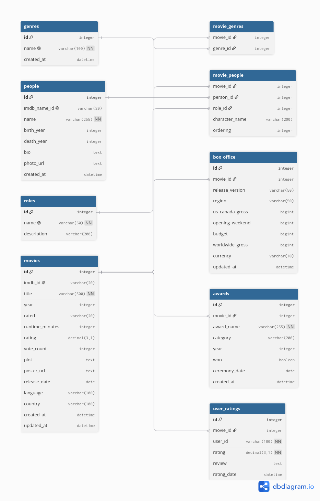

# 🎬 IMDb Top 250 Analysis

## 📖 Overview

This project provides a comprehensive data analysis pipeline for the **IMDb Top 250** movies dataset. It goes beyond simple scraping by implementing a **fully normalized, professional-grade relational database schema** that supports advanced analytics, trend detection, and complex querying.

The goal is to uncover hidden patterns in cinema history—exploring how genres, directors, actors, and budgets interact to create the most acclaimed movies of all time.

---

## 🗄️ Database Schema (ERD)

To enable robust, scalable analysis, I designed a highly normalized database structure (3NF) featuring separate tables for `movies`, `genres`, `people` (directors/writers/actors), `box_office`, `awards`, and `user_ratings`. This design allows for deep-dive analytical queries (e.g., genre-rating correlations, director impact, budget-to-profit analysis) without data redundancy.

> *Export this visual directly from [dbdiagram.io](https://dbdiagram.io) using the provided DBML code in the `/database` directory.*

---

## 🎯 Key Objectives & Analysis Questions

- **Genre Impact**: Which genres consistently score the highest average ratings?
- **Director Influence**: Which directors have the most entries in the Top 250? Does their average runtime correlate with ratings?
- **Budget vs. Acclaim**: Is there a correlation between a high budget and a place in the Top 250, or do indie films dominate?
- **Temporal Trends**: How has the distribution of top movies changed across decades (e.g., 60s classics vs. modern blockbusters)?
- **Actor Metrics**: Which actors have appeared in the most Top 250 films, and what is their average movie rating?
- **Award Correlation**: How strongly do Oscar wins/nominations predict a spot in the Top 250?

---

## 📊 Dataset

The dataset consists of scraped metadata for the current **IMDb Top 250** list, including:

- **Movie Attributes**: Title, Year, Rating, Vote Count, Runtime, Plot, Poster URL.
- **People**: Directors, Writers, and Top Cast members (with character names).
- **Financial Data**: Budget, US/Canada Gross, Opening Weekend, and Worldwide Gross.
- **Awards**: Oscar and major film festival nominations/wins.

---

## 🛠️ Tech Stack

| Layer | Technology |
|-------|------------|
| **Data Processing** | Python, Pandas, NumPy |
| **Database Design** | DBML (dbdiagram.io) |
| **Database Engine** | PostgreSQL / SQLite (Compatible with both) |
| **SQL Integration** | SQLAlchemy, Psycopg2 |
| **Data Visualization** | Matplotlib, Seaborn, Plotly |
| **Environment** | Jupyter Notebook, VSCode |

---
